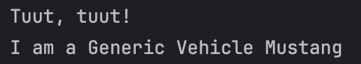
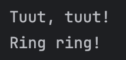
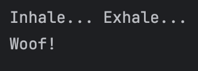
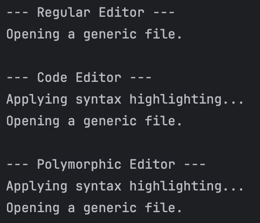
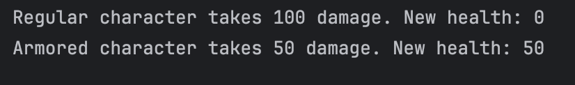
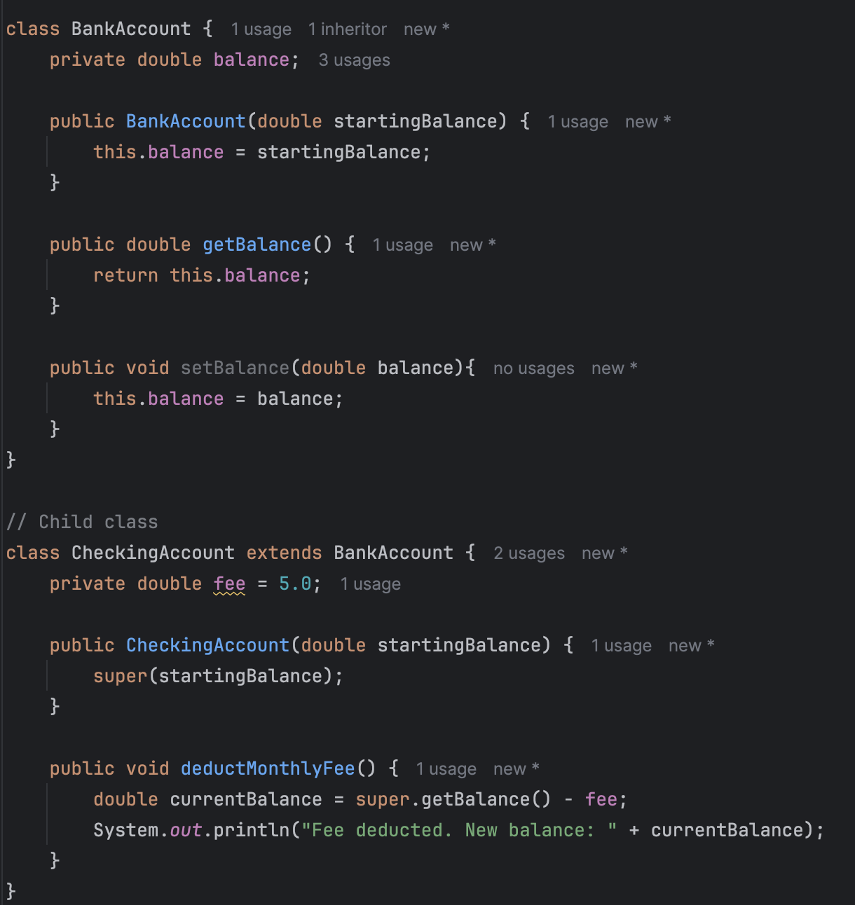

# The Power of Inheritance

Submitted by: Christian Choa  
Date: August 12, 2025

### 1. Designing Methods
1. Prediction: A
2. Output:   
3. Mini Challenge Output: 

### 2. Abstract Classes: Defining a Template
1. Prediction: B
2. Output:   
3. Mini Challenge Output: 

### 3. Method Overriding: Providing a New Implementation
1. Prediction: B
2. Output:   
3. Mini Challenge Output: 

### 4. Inheriting Variables & Access Rules
1. Mini Challenge: <b1>

